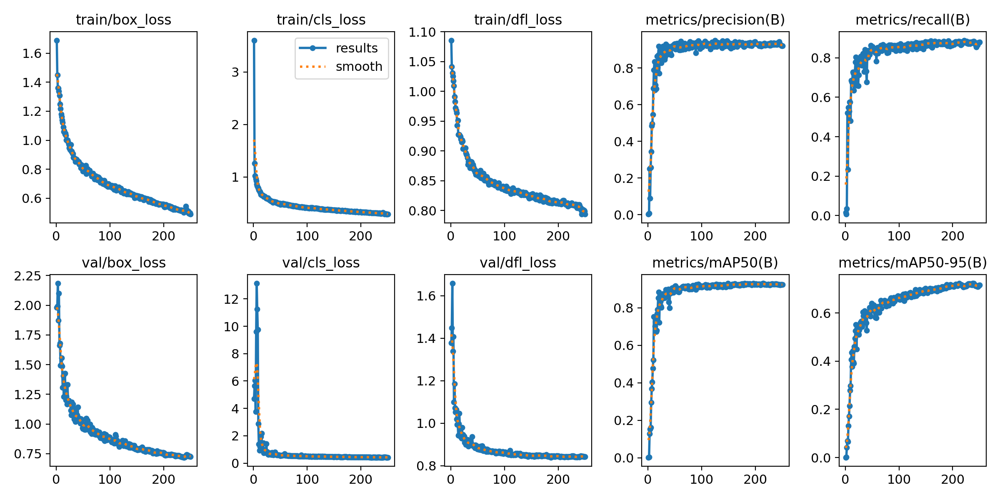
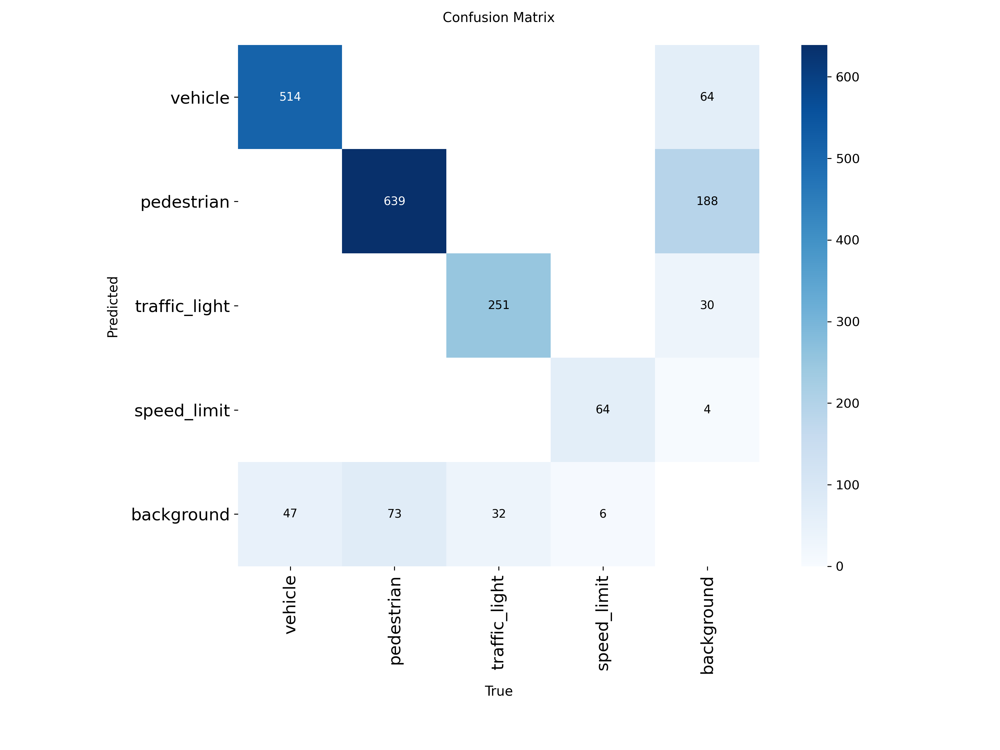
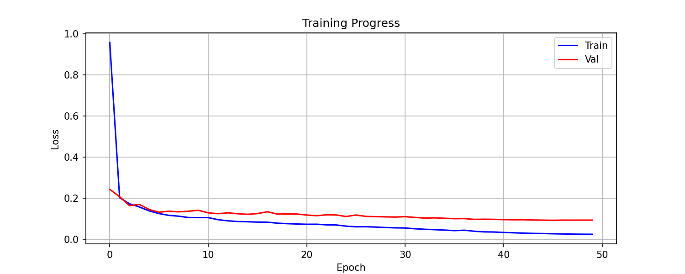
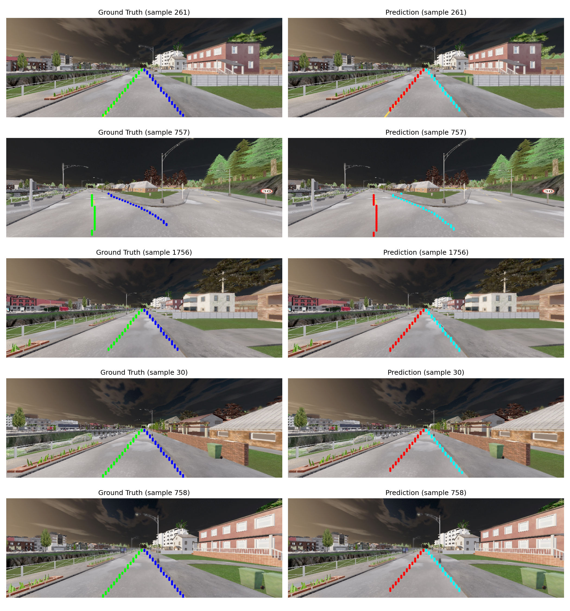

# CARLA Autonomous Driving System

[](https://opensource.org/licenses/MIT)
[](https://www.python.org/downloads/release/python-380/)
[](https://carla.org/)
[](https://pytorch.org/)

A complete autonomous driving system for the CARLA simulator, developed for **CMPE 789 - Robot Perception** at Rochester Institute of Technology.

## 🎬 Demo Videos

| Demo | Description |
|------|-------------|
| [carla_final_v2.webm](docs/carla_final_v2.webm) | **Final system** with YOLO + UFLD + waypoint navigation |
| [carla_final_v1.webm](docs/carla_final_v1.webm) | Earlier version demo |
| [fp_demo_5_ufld.webm](docs/fp_demo_5_ufld.webm) | System **before** UFLD fine-tuning (for comparison) |

## 🎯 Overview

This project implements a multi-modal perception and control pipeline for autonomous driving in the CARLA 0.9.15 simulator.

| Component | Model | Purpose |
|-----------|-------|---------|
| **Object Detection** | YOLO11n (custom-trained) | Vehicles, pedestrians, traffic lights, speed signs |
| **Lane Detection** | UFLD ResNet-18 (fine-tuned) | Lane boundary identification |
| **Traffic Light Recognition** | HSV Color Analysis | Red/Yellow/Green state detection |
| **Vehicle Control** | Hybrid Lane + Waypoint | Steering and speed management |

### Key Features

- ✅ Real-time object detection (4 classes: vehicle, pedestrian, traffic_light, speed_limit)
- ✅ Lane-following with UFLD neural network (100×56 grid)
- ✅ HSV-based traffic light color recognition
- ✅ Waypoint-based fallback navigation for intersections/turns > 5°
- ✅ Adaptive speed control based on obstacles
- ✅ 20 km/h speed cap with turn-aware reduction (70% in turns)

### System Architecture

```
┌─────────────────────────────────────────────────────────────────────┐
│                    CARLA Simulator (0.9.15)                          │
│   Map: Town01  |  Vehicle: Tesla Model 3  |  Traffic: NPCs          │
└───────────────────────────┬─────────────────────────────────────────┘
                            │ RGB Camera (1640×590, FOV=150°)
                            ▼
┌─────────────────────────────────────────────────────────────────────┐
│                       Perception Pipeline                            │
│  ┌─────────────────────────┐    ┌─────────────────────────────────┐ │
│  │   YOLO11n Detection     │    │      UFLD Lane Detection        │ │
│  │  ├─ Vehicles (cls 0)    │    │  ├─ Left lane boundary          │ │
│  │  ├─ Pedestrians (cls 1) │    │  ├─ Right lane boundary         │ │
│  │  ├─ Traffic lights (2)  │    │  ├─ Center line computation     │ │
│  │  └─ Speed signs (cls 3) │    │  └─ 800×288 → 1640×590 scale    │ │
│  └───────────┬─────────────┘    └──────────────┬──────────────────┘ │
│              │                                  │                    │
│              ▼                                  ▼                    │
│  ┌─────────────────────────┐    ┌─────────────────────────────────┐ │
│  │  HSV Traffic Light      │    │    Lane Center Steering         │ │
│  │  Color Detection        │    │    Calculation                  │ │
│  │  Red/Yellow → STOP      │    │    ├─ Lateral offset            │ │
│  │  Green → GO             │    │    └─ Lookahead angle           │ │
│  └───────────┬─────────────┘    └──────────────┬──────────────────┘ │
└──────────────┼──────────────────────────────────┼────────────────────┘
               │                                  │
               ▼                                  ▼
┌─────────────────────────────────────────────────────────────────────┐
│                        Control Pipeline                              │
│  ┌─────────────────────────────────────────────────────────────────┐│
│  │ Decision Logic: IF lane_angle ≤ 5° → Lane steering              ││
│  │                 ELSE → Waypoint steering (fallback)             ││
│  └─────────────────────────────────────────────────────────────────┘│
│  ┌────────────────────────┐    ┌────────────────────────────────┐   │
│  │  Throttle/Brake        │    │  Steering Control              │   │
│  │  Base: 20 km/h cap     │    │  Max: ±70° | Threshold: 5°     │   │
│  │  Turn: 70% speed       │    │  Normalized to [-1, 1]         │   │
│  └────────────────────────┘    └────────────────────────────────┘   │
└─────────────────────────────────────────────────────────────────────┘
```

## 📁 Project Structure

```
├── src/                           # Source code
│   ├── carla_autonomous_driving.py  # Main autonomous driving system
│   ├── carla_connection_test.py     # CARLA server connection test
│   └── ultrafastLaneDetector/       # UFLD model implementation
│       ├── ultrafastLaneDetector.py
│       ├── ultrafastLaneDetectorV2.py
│       └── ...
├── models/                        # Pre-trained model weights
│   ├── yolo_carla/                  # YOLO models trained on CARLA data
│   ├── ufld_carla/                  # Fine-tuned UFLD models
│   └── tusimple_pretrained.pth      # Pre-trained TuSimple weights
├── notebooks/                     # Jupyter notebooks for training
│   ├── ufld_training.ipynb
│   └── yolo_training.ipynb
├── datasets/                      # Dataset folder (not included in repo)
├── docs/                          # Documentation and presentations
├── utils/                         # Dataset utilities
│   ├── find_invalid_classes.py
│   ├── plot_class_distribution.py
│   ├── verify_dataset_labels.py
│   ├── validate_dataset_merge.py
│   └── validate_dataset_remap.py
├── configs/                       # Configuration files
├── environment.yml                # Conda environment file
├── requirements.txt               # Pip requirements file
└── README.md                      # This file
```

## 🚀 Quick Start

### Prerequisites

1. **CARLA Simulator 0.9.15**: Download from [CARLA Releases](https://github.com/carla-simulator/carla/releases/tag/0.9.15)
2. **Python 3.8**: Required for CARLA 0.9.15 compatibility
3. **NVIDIA GPU**: Recommended for real-time inference (tested on RTX 3060)
4. **CUDA**: Installed and configured for PyTorch GPU support

### Installation

1. **Clone the repository**:
   ```bash
   git clone https://github.com/YourUsername/carla-autonomous-driving.git
   cd carla-autonomous-driving
   ```

2. **Create the conda environment**:
   ```bash
   conda env create -f environment.yml
   conda activate carla_env
   ```

   Or using pip:
   ```bash
   pip install -r requirements.txt
   ```

3. **Configure CARLA Path**:
   
   Open `src/carla_autonomous_driving.py` and update the `CARLA_PATH` variable:
   ```python
   CARLA_PATH = '/path/to/your/CARLA_0.9.15/PythonAPI/carla/dist/carla-0.9.15-py3.8-linux-x86_64.egg'
   ```
   
   **Note**: The CARLA Python API is distributed as an `.egg` file. The path format varies by OS:
   - **Linux**: `carla-0.9.15-py3.8-linux-x86_64.egg`
   - **Windows**: `carla-0.9.15-py3.8-win-amd64.egg`

4. **Download model weights** (if using Git LFS):
   ```bash
   git lfs pull
   ```

### Running the System

1. **Start CARLA Server**:
   ```bash
   # Linux
   cd /path/to/CARLA_0.9.15
   ./CarlaUE4.sh -quality-level=Low
   
   # Windows
   CarlaUE4.exe -quality-level=Low
   ```

2. **Run the Autonomous Driving System**:
   ```bash
   cd src
   python carla_autonomous_driving.py
   ```

3. **Test CARLA Connection** (optional):
   ```bash
   python carla_connection_test.py
   ```

## 🧠 Models

### YOLO11n Object Detection

Custom-trained on CARLA simulator data using Ultralytics framework.

**Classes Detected:**
- 🚗 **Class 0**: Vehicles (cars, trucks)
- 🚶 **Class 1**: Pedestrians
- 🚦 **Class 2**: Traffic lights
- 🚸 **Class 3**: Speed limit signs

#### YOLO Training Hyperparameters

| Parameter | Value |
|-----------|-------|
| Base Model | `yolo11n.pt` (Ultralytics) |
| Epochs | 250 |
| Batch Size | 128 (Google Colab) |
| Image Size | 640×640 |
| Optimizer | AdamW |
| Learning Rate | 0.005 |
| Early Stopping | 60 epochs patience |
| Augmentation | Enabled |
| Pretrained | Yes (COCO weights) |
| Freeze Layers | 0 (full fine-tune) |

#### YOLO Training Results




---

### Ultra Fast Lane Detection (UFLD)

Fine-tuned on CARLA synthetic lane data using TuSimple format.

#### UFLD Architecture

| Parameter | Value |
|-----------|-------|
| Backbone | ResNet-18 |
| Pre-trained | TuSimple dataset |
| Input Size | 800×288 (model) → 1640×590 (camera) |
| Grid Cells | 100 horizontal bins |
| Row Anchors | 56 (bottom 60% of image) |
| Lanes | 4 (only 2 used: left, right) |

#### UFLD Training Hyperparameters

| Parameter | Value |
|-----------|-------|
| Epochs | 50 |
| Batch Size | 32 |
| Optimizer | Adam |
| Learning Rate | 1e-4 |
| Weight Decay | 1e-4 |
| Gradient Clip | 1.0 |
| LR Scheduler | CosineAnnealingLR |
| Sim Loss Weight | 1.0 |
| Shape Loss Weight | 0.0 |

#### UFLD Loss Functions

| Loss | Purpose |
|------|-------|
| **SoftmaxFocalLoss** | Row-anchor classification (γ=2, focuses on hard examples) |
| **ParsingRelationLoss** | Structural consistency between adjacent rows |
| **ParsingRelationDis** | Shape consistency (curvature smoothness) |

#### UFLD Training Results




## ⚙️ Configuration

### Model Paths

Modify in `src/carla_autonomous_driving.py`:
```python
YOLO_MODEL_PATH = '../models/yolo_carla/carla_yolo11n_one_map2/weights/best.pt'
UFLD_MODEL_PATH = '../models/ufld_carla/checkpoint_best.pth'
```

### Control Parameters

#### Steering Strategy

The system uses a **hybrid steering approach**:

1. **Lane-Based Steering** (primary): When UFLD detects lanes with confidence > 0.3 and steering angle ≤ 5°
2. **Waypoint-Based Steering** (fallback): For intersections, turns > 5°, or when lanes not detected

```python
STEERING_THRESHOLD = 5.0   # degrees - threshold for lane vs waypoint steering
MAX_STEER_DEGREES = 70     # physical steering limit
base_target_speed = 20     # km/h - maximum speed cap
```

#### Speed Control Logic

```python
# Safe distances (triggers speed reduction/stop)
safe_distance_vehicle = 15.0       # meters - slow down proportionally
safe_distance_pedestrian = 10.0    # meters - full stop
safe_distance_traffic_light = 20.0 # meters - check HSV color

# Turn-aware speed
if steering_angle > 10°:
    target_speed = base_speed * 0.7  # 14 km/h in turns
```

#### Camera Configuration

```python
# Must match UFLD training data exactly
image_width = 1640
image_height = 590
fov = 150  # degrees (wide angle for lane visibility)
camera_position = (x=1.5, z=2.4)  # meters from vehicle center
```

## 📊 System Parameters

| Component | Parameter | Value |
|-----------|-----------|-------|
| YOLO | Confidence Threshold | 0.3 |
| YOLO | Classes | 4 (vehicle, pedestrian, traffic_light, speed_limit) |
| UFLD | Grid Resolution | 100×56 |
| UFLD | Coordinate Scaling | 2.05× (800→1640 width) |
| Control | Simulation Delta | 0.3 seconds |
| Control | Max Speed | 20 km/h |
| Control | Turn Speed | 14 km/h (70%) |
| Control | Lane Confidence | > 0.3 to use |

## 📚 Documentation

- [Presentation (PPTX)](docs/CARLA_Autonomous_Driving_Presentation.pptx)
- [Technical Report (PDF)](docs/CARLA_Autonomous_Driving_Report.pdf)

## 🛠️ Development

### Training Custom Models

See the Jupyter notebooks for training details:
- `notebooks/yolo_training.ipynb` - YOLO training pipeline
- `notebooks/ufld_training.ipynb` - UFLD fine-tuning pipeline

### Dataset Utilities

The `utils/` folder contains scripts for dataset validation:
```bash
cd utils
python plot_class_distribution.py  # Visualize class distribution
python verify_dataset_labels.py    # Validate label files
```

## 🔧 Troubleshooting

### CARLA Connection Issues

1. Ensure CARLA server is running before starting the client
2. Check that port 2000 is not blocked by firewall
3. Verify Python version matches the `.egg` file version

### GPU Memory Issues

1. Reduce batch size in training scripts
2. Use smaller YOLO model variant (yolo11n instead of yolo11m)
3. Close other GPU-intensive applications

### Import Errors

1. Verify conda environment is activated
2. Check CARLA_PATH is correctly set
3. Run: `pip install -r requirements.txt`

## 📄 License

This project is licensed under the MIT License - see the [LICENSE](LICENSE) file for details.

## 👤 Author

**Justin Mascarenhas**
- Course: CMPE 789 - Robot Perception
- Institution: Rochester Institute of Technology
- Semester: Fall 2024

## 🙏 Acknowledgments

- [CARLA Simulator](https://carla.org/) - Open-source autonomous driving simulator
- [Ultralytics YOLO](https://github.com/ultralytics/ultralytics) - Object detection framework
- [Ultra Fast Lane Detection](https://github.com/cfzd/Ultra-Fast-Lane-Detection) - Lane detection model
- [TuSimple Dataset](https://github.com/TuSimple/tusimple-benchmark) - Lane detection benchmark

## 📝 Citation

If you use this work in your research, please cite:
```bibtex
@misc{mascarenhas2024carla,
  author = {Mascarenhas, Justin},
  title = {CARLA Autonomous Driving System with YOLO and UFLD},
  year = {2024},
  institution = {Rochester Institute of Technology},
  course = {CMPE 789 - Robot Perception}
}
```
